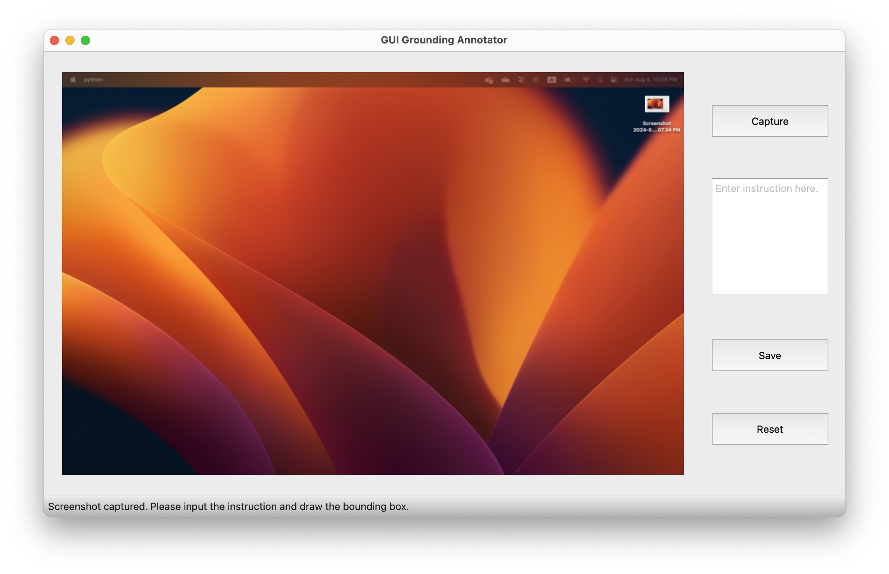

# Annotate single-step GUI grounding dataset

With AgentStudio, you can easily create a dataset with **single-step UI grounding**, consisting of tuples of <screenshot, instruction, bbox (left, top, width, height)>.

## Local annotator

Local annotator requires at least two screens (one for recording, and one for annotation):

```bash
python annotate_ground_ui.py --local_monitor_idx 1 --record_path recordings
```

## Remote annotator

You can also annotate on another machine with VNC:

```bash
python annotate_ground_ui.py --record_path recordings --remote --vnc_server_addr 127.0.0.1 --vnc_server_port 5900 --vnc_password 123456
```

The address and port are set in the [docker setup](./install.md).

## Usage

Follow the steps below to complete the annotation process as guided by the status bar. Although this interface cannot directly interact with the device, you can operate outside of this interface to navigate (on another screen (local), or through a VNC viewer (remote)).

**Step 1**: The left section of the window will stream the display from the specified `--local_monitor_idx` provided in your command. Click 'Capture' to take a screenshot. This will stop the streaming and display your screenshot on the left side.



**Step 2**: After capturing the screenshot, you will be prompted to input instructions and draw a bounding box. Click on any point in the left side and drag the mouse to create the bounding box.


**Step 3**: Once you've completed Step 2, click 'Save' to add your screenshot and annotation to a JSONL file (specified by `--record_path` in your command).

**Step 4**: Click 'Reset' to annotate another data point. This will bring you back to Step 1.
